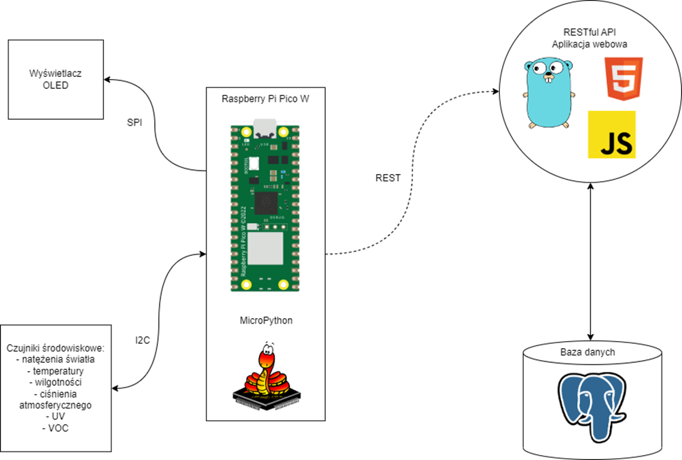

# Greenico on Raspberry Pi Pico

Weather station with Raspberry Pi Pico - "Greenico"

[Greenico on Raspberry Pi Pico](https://github.com/anras5/Greenico) is only a part of `Greenico` project.

The second part is [GreenicoAPI](https://github.com/anras5/GreenicoAPI). Be sure to check it out also.

## Table of contents

1. [The purpose of the project](#Purpose)
2. [Schema](#Schema)
3. [Description](#Description)
4. [Technical information](#Technical)
5. [Contact](#Contact)

## Purpose

The aim of the project is to allow the user to view the current state of the weather by designing and building a weather
station. The preview will be possible through a browser, i.e. a web application in the form of clear graphs and on the
display attached to the weather station.

## Schema



Schema is in polish

## Description

The purpose of the project was to build a platform that allows the user to observe the current conditions of weather.
For this purpose, it was decided to use the Raspberry Pi Pico W microcontroller with the kit of environmental sensors
and an OLED display. In addition, to make it easier to view the results, they were supposed to be sent over the network
to a server where the results would be stored in a database and displayed in an accessible way in the form of graphs. As
part of the project, it was possible to build and program a weather station that performs measurements with appropriate
sensors. These are measurements of air pollution, temperature, humidity, illuminance, atmospheric pressure and UV.
Current measurements are displayed on the OLED display attached to the weather station and sent over the network to the
server via the HTTP protocol (REST).

## Technical

### Technologies used

**Hardware platform used** \
Raspberry Pi Pico W programmed in [MicroPython](https://micropython.org/)

**Sensors** \
TSL25911FN, BME280, LTR390-UV-1, SGP40

**Display** \
2.23inch OLED Display Module for Raspberry Pi Pico

### The most important code snippets with comments

```python
import network
import urequests
import ujson
import utime
from machine import I2C, Pin
import config
from oled_display.oled_spi import OLED_2inch23
from environmentSensor.BME280 import BME280  # pressure, temp, hum
from environmentSensor.LTR390 import LTR390  # UV
from environmentSensor.SGP40 import SGP40
from environmentSensor.TSL2591 import TSL2591
from environmentSensor.voc_algorithm import VOCAlgorithm
```

At the beginning of the program, the appropriate libraries should be imported - first available directly in MicroPython
and then files from the project:

- config, which contains the SSID and password for the wifi network, as well as the server address
- oled_spi from the oled_display directory, where there is a class that facilitates work with the OLED display
- classes from the environmentSensor directory that facilitate working with sensors
- voc_algorithm from the environmentSensor directory where the responsible class is located converting readings from
  SGP40 sensor to VOC index

```python
bme280 = BME280()
bme280.get_calib_param()
light = TSL2591()
sgp = SGP40()
uv = LTR390()
voc = VOCAlgorithm()
voc.vocalgorithm_init()
```

Create appropriate objects for sensors and initialize them if necessary

```python
screen = OLED_2inch23()
screen.fill(screen.black)
screen.text(f'Conn to wifi...', 1, 12, screen.white)
screen.show()
```

Creating an object for the OLED display and displaying the inscription about connecting to the network wireless.

```python
lan = network.WLAN(network.STA_IF)
wlan.active(True)
wlan.connect(config.ssid, config.password)
```

Connecting to the wireless network (later in the program, the correctness of the connection is checked)

**Main loop:**

```python
for i in range(20):
    bme = bme280.readData()
    pressure.append(round(bme[0], 2))
    temp.append(round(bme[1], 2))
    hum.append(round(bme[2], 2))
    lux.append(round(light.Lux(), 2))
    uvs.append(round(uv.UVS(), 2))
    gas_raw.append(round(sgp.raw(), 2))
    screen.fill(screen.black)
    screen.text(f'Data gathering' + '.' * (i % 3), 1, 12, screen.white)
    screen.show()
    utime.sleep(4)
```

Getting the readings from the sensors (then the program rejects the values of the largest and the smallest and averaging
of the readings taken) and displaying information about data collection on display.

```python
post_data = ujson.dumps({
    "id": 1,
    "temperature": temp,
    "humidity": hum,
    "pressure": pressure,
    "voc": gas,
    "uv": uvs,
    "light": lux
})
r = urequests.post(f"{config.URL_API}/api/reading", headers={'content-type':
                                                                 'application/json'}, data=post_data)
r.close()
```

Preparing data to be sent to the server using the `ujson` library and sending them using
`urequests` library. Closing the variable storing data obtained in response from the server.

```python
for i in range(48):
    if i % 2:
        screen.fill(screen.black)
        screen.text(f'Temp: {temp}', 1, 2, screen.white)
        screen.text(f'Hum: {hum}', 1, 12, screen.white)
        screen.text(f'Pres: {pressure}', 1, 22, screen.white)
        screen.show()
    else:
        screen.fill(screen.black)
        screen.text(f'VOC: {gas}', 1, 2, screen.white)
        screen.text(f'UV: {uvs}', 1, 12, screen.white)
        screen.text(f'Light: {lux}', 1, 22, screen.white)
        screen.show()
    utime.sleep(5)
```

Displaying of retrieved values on the display.

**End of main loop**

### How to run the app

1. Download `.uf2` file with *MicroPython* for *Raspberry Pi Pico W* binary on your computer
   from [Micropython with urequests and upip](https://micropython.org/download/rp2-pico-w/rp2-pico-w-latest.uf2)
2. Follow steps from [documentation](https://www.raspberrypi.com/documentation/microcontrollers/micropython.html#:~:text=and%20upip%20preinstalled)-,Then%20go%20ahead%20and%3A,-Push%20and%20hold)
3. Upload `environmentSensor` and `oled_display` folders to your *Pico*.
4. Create `config.py` file which should look like this:
```python
ssid = "YOUR_SSID"
password = "YOUR_PASSWORD"
URL_API = "URL_OF_SERVER"
```
5. Flash `main.py` file to your *Pico*.
6. Done!

# Contact

Contact me at: \
anras1filip@gmail.com